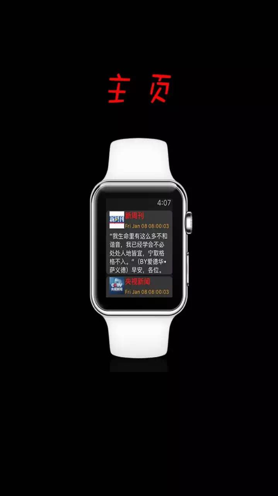
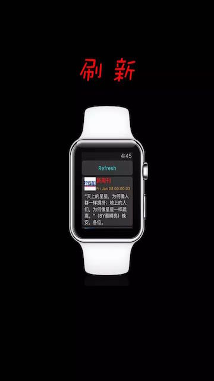
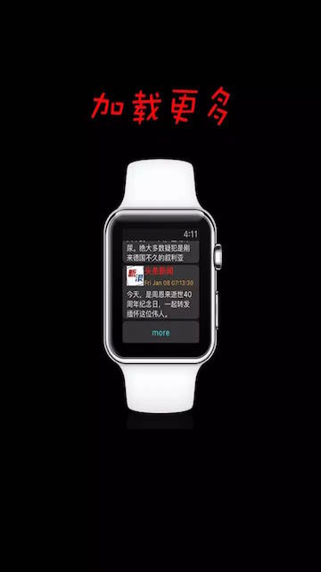
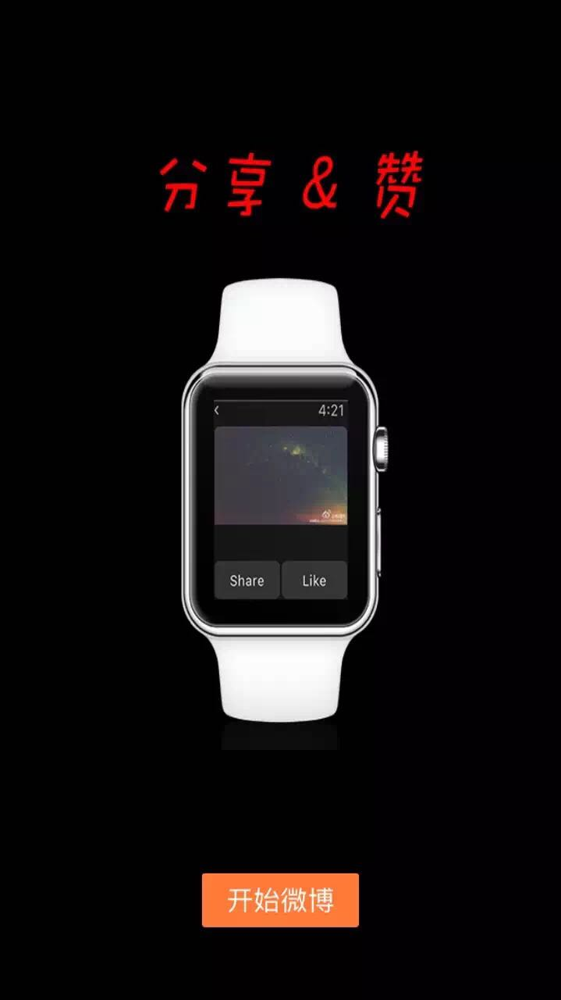

# SinaMicroBlog-iWatch

This is a [Sina Microblog](https://en.wikipedia.org/wiki/Sina_Weibo) App for Apple Watch and is motivated by [CoderMJLee](https://github.com/CoderMJLee)'s IOS course project.

## Motivation
Sina Microblog is one of the most popular social network in China. However, there is still no good app available for App Watch. Thus, I design and implement the first App for Apple Watch which has the following outstanding features:
1. It's an app for Apple Watch that allows users to access Sina microblog via     Apple Watch;
2. It's the **first** Apple Watch app that can refresh and load more status;         
3. It's the **first** Apple Watch app that can display shared status;
4. It allows users to read more detailed information about a status;
5. It allows users to 'like' or 'share' status. 

## New feature Display

### Home
 
 
### Refresh

### Load More

### Details

### Share & Like

## Brief Technical Introduction
This app is developed based on [network interface](http://open.weibo.com) provided by Sina. Since there's no keyboard in Apple Watch, users can just log in by their iPhone. Then, iPhone and Apple Watch build a network connection by [WatchConnectivity](https://developer.apple.com/library/watchos/documentation/WatchConnectivity/Reference/WatchConnectivity_framework/) and data can be transferred between the two devices. 

## To Readers

There are still many places can be improved. For example, log out function can be added. Also, sometimes app may crash because of the usage of multi-thread technique in downloading pictures(since there's no library for Apple Watch to download pictures Asynchronously). Therefore, I welcome every reader to fork this project and help me to make this project be a great product!